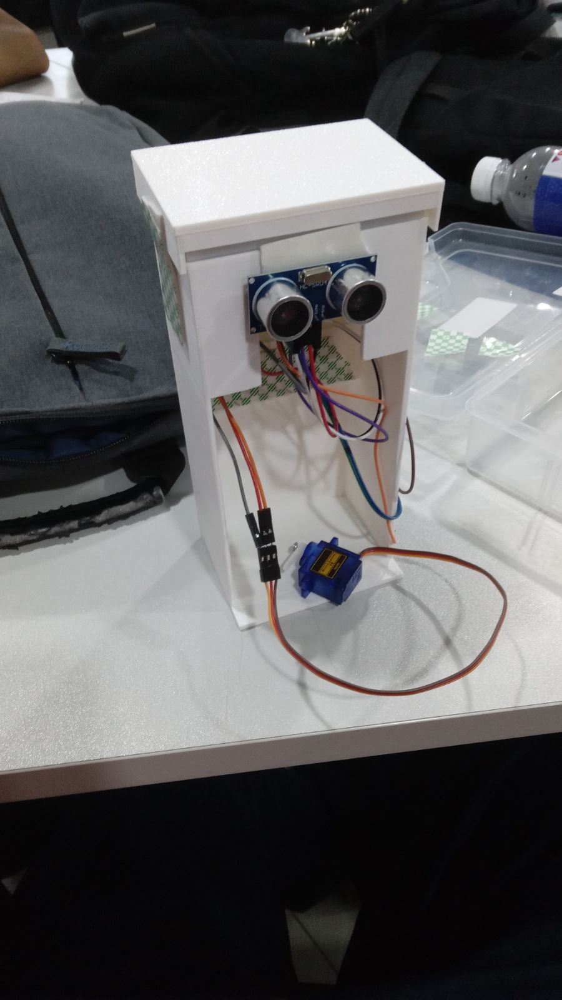
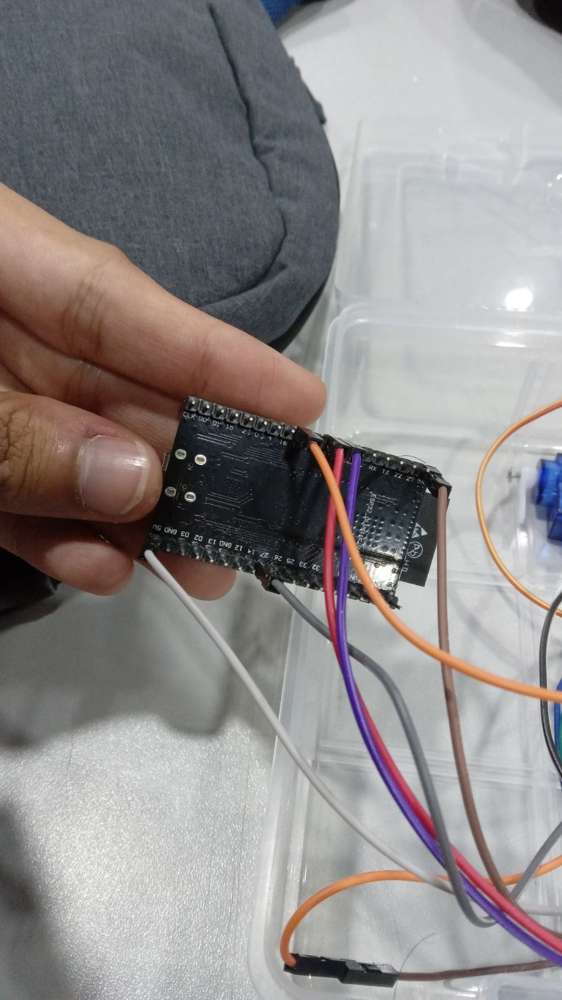

---

# รายงานโครงการระบบฉีดพ่นสเปรย์อัตโนมัติด้วยเซนเซอร์ตรวจจับพร้อมเสียงเพลงประกอบ

## 1. บทนำ

โครงการนี้เป็นส่วนหนึ่งของวิชา **ไมโครคอนโทรลเลอร์** ระดับชั้น ปวช.2 โดยมีวัตถุประสงค์เพื่อสร้างระบบสมองกลฝังตัวที่สามารถควบคุมการทำงานของเครื่องพ่นสเปรย์ให้ทำงานสัมพันธ์กับเซนเซอร์ตรวจจับ และเล่นเพลงประกอบเพื่อความผ่อนคลายก่อนที่สเปรย์จะถูกพ่นออกมา 

## 2. อุปกรณ์ที่ใช้ในวงจร

เพื่อให้ระบบทำงานได้อย่างสมบูรณ์ อุปกรณ์หลักที่ใช้ประกอบด้วย: 

**Microcontroller:** ESP32 (ใช้ควบคุมการรับค่าและสั่งงาน) 

**Sensor:** เซนเซอร์อัลตราโซนิก (Ultrasonic Sensor) สำหรับตรวจจับระยะวัตถุ 

**Actuator:** มอเตอร์เซอร์โว (Servo Motor) สำหรับกดหัวสเปรย์ 

**Audio:** Passive Buzzer สำหรับเล่นเสียงเพลงประกอบ 

**Power:** แหล่งจ่ายไฟจากกระบะถ่าน หรือแบตเตอรี่ 18650 

## 3. หลักการทำงานของระบบ

ระบบถูกออกแบบให้ทำงานเป็นลำดับขั้นตอน (Sequence) ดังนี้: 

1. **Standby:** เครื่องรอรับสัญญาณจากเซนเซอร์อัลตราโซนิก 

2. **Detection:** เมื่อเซนเซอร์ตรวจพบวัตถุในระยะที่กำหนด (DISTX) 

3. **Action:** * ลำโพง Buzzer จะเล่นเพลงประกอบ 

* มอเตอร์เซอร์โวจะหมุนไปที่องศาที่กำหนด (เช่น 90°) เพื่อกดหัวฉีดน้ำหอม 

* น้ำหอมพ่นออกมา 

4. **Reset:** มอเตอร์หมุนกลับที่เดิมและหน่วงเวลา (Delay) เพื่อป้องกันการพ่นซ้ำซ้อน ก่อนจะกลับไปเริ่มทำงานใหม่ 

## 4.โค้ดการทํางาน 
#include <Arduino.h> 
#include <ESP32Servo.h> 
#include <Ultrasonic.h> 
int SERVO = 27; 
int TRIG = 19; 
int ECHO = 18; 
int DISTX = 20; 
int BUZZER = 17; 
Servo srvo; 
Ultrasonic ultrasonic(TRIG, ECHO, 40000UL); 
bool triggered = false; 
void song(int buzzerPin) { 
tone(buzzerPin, 330); 
delay(667); 
noTone(buzzerPin); 
tone(buzzerPin, 247); 
delay(333); 
noTone(buzzerPin); 
tone(buzzerPin, 262); 
delay(333); 
noTone(buzzerPin); 
tone(buzzerPin, 294); 
  delay(667); 
  noTone(buzzerPin); 
 
  tone(buzzerPin, 262); 
  delay(333); 
  noTone(buzzerPin); 
 
  tone(buzzerPin, 247); 
  delay(333); 
  noTone(buzzerPin); 
 
  delay(1); 
 
  tone(buzzerPin, 220); 
  delay(667); 
  noTone(buzzerPin); 
 
  tone(buzzerPin, 220); 
  delay(333); 
  noTone(buzzerPin); 
 
  delay(1); 
 
  tone(buzzerPin, 262); 
  delay(333); 
  noTone(buzzerPin); 
 
  tone(buzzerPin, 330); 
  delay(667); 
  noTone(buzzerPin); 
 
  tone(buzzerPin, 294); 
  delay(333); 
  noTone(buzzerPin); 
 
  tone(buzzerPin, 262); 
  delay(333); 
  noTone(buzzerPin); 
 
  tone(buzzerPin, 247); 
  delay(667); 
  noTone(buzzerPin); 
 
  tone(buzzerPin, 247); 
  delay(333); 
  noTone(buzzerPin); 
 
  tone(buzzerPin, 262); 
  delay(333); 
  noTone(buzzerPin); 
 
  delay(1); 
 
  tone(buzzerPin, 294); 
  delay(667); 
  noTone(buzzerPin); 
 
  tone(buzzerPin, 330); 
  delay(667); 
  noTone(buzzerPin); 
 
  tone(buzzerPin, 262); 
  delay(667); 
  noTone(buzzerPin); 
 
  tone(buzzerPin, 220); 
  delay(667); 
  noTone(buzzerPin); 
 
  tone(buzzerPin, 220); 
  delay(667); 
  noTone(buzzerPin); 
 
  delay(1000); 
 
  tone(buzzerPin, 294); 
  delay(667); 
  noTone(buzzerPin); 
 
  tone(buzzerPin, 349); 
  delay(333); 
  noTone(buzzerPin); 
 
  tone(buzzerPin, 440); 
  delay(667); 
  noTone(buzzerPin); 
 
  tone(buzzerPin, 392); 
  delay(333); 
  noTone(buzzerPin); 
 
  tone(buzzerPin, 349); 
  delay(333); 
  noTone(buzzerPin); 
 
  tone(buzzerPin, 330); 
  delay(1000); 
  noTone(buzzerPin); 
 
  tone(buzzerPin, 262); 
  delay(333); 
  noTone(buzzerPin); 
 
  delay(1); 
 
  tone(buzzerPin, 330); 
  delay(667); 
  noTone(buzzerPin); 
 
  tone(buzzerPin, 294); 
  delay(333); 
  noTone(buzzerPin); 
 
  delay(1); 
 
  tone(buzzerPin, 262); 
  delay(333); 
  noTone(buzzerPin); 
 
  tone(buzzerPin, 247); 
  delay(667); 
  noTone(buzzerPin); 
 
  tone(buzzerPin, 247); 
  delay(333); 
  noTone(buzzerPin); 
 
  tone(buzzerPin, 262); 
  delay(333); 
  noTone(buzzerPin); 
 
  tone(buzzerPin, 294); 
  delay(667); 
  noTone(buzzerPin); 
 
  tone(buzzerPin, 330); 
  delay(667); 
  noTone(buzzerPin); 
 
  tone(buzzerPin, 262); 
  delay(667); 
  noTone(buzzerPin); 
 
  tone(buzzerPin, 220); 
  delay(667); 
  noTone(buzzerPin); 
 
  tone(buzzerPin, 220); 
  delay(667); 
  noTone(buzzerPin); 
} 
 
void setup() { 
    Serial.begin(115200); 
    Serial.println("TETRIS 1!"); 
     
    srvo.write(0); 
 
    song(BUZZER); 
    delay(500); 
    Serial.println("TETRIS 2!"); 
    song(BUZZER); 
    delay(500); 
    Serial.println("TETRIS 3!"); 
    song(BUZZER); 
 
    srvo.attach(SERVO); 
    srvo.write(0); 
    Serial.println("READY!"); 
} 
 
 
void loop() { 
 
    unsigned int dist = ultrasonic.read(CM); 
 
    if (dist == 0) return; 
 
    Serial.println(dist); 
 
    if (dist <= DISTX && !triggered) { 
 
        triggered = true; 
 
        srvo.write(90); 
        delay(5000);  
 
        srvo.write(0); 
 
        delay(1000); 
        srvo.detach(); 
 
        ESP.restart(); 
        return; 
    } 
 
    // Reset trigger when object leaves 
    if (dist > DISTX) { 
        triggered = false; 
    } 
 
    delay(200); 
}

## 5. ภาพชิ้นงานจริงและแผงวงจร

### ชิ้นงานจริง (Physical Prototype)

โครงสร้างถูกสร้างขึ้นเพื่อยึดอุปกรณ์ทั้งหมดเข้าด้วยกัน โดยมีเซนเซอร์ตรวจจับติดตั้งอยู่ด้านหน้า

### การต่อวงจร (Circuit Assembly)

การเชื่อมต่อสายไฟจากบอร์ดไมโครคอนโทรลเลอร์ไปยังอุปกรณ์ต่างๆ เช่น เซนเซอร์ และมอเตอร์เซอร์โว

---

## 6. การตรวจสอบและทดสอบระบบ

จากการทดสอบพบว่าระบบทำงานได้ตามเงื่อนไขที่วางไว้: 

**เมื่อไม่มีสิ่งกีดขวาง:** ระบบไม่ทำงาน 

**เมื่อบังเซนเซอร์:** ทุกอย่างทำงานตามลำดับเพลงและมอเตอร์กด 

**ความแรงของมอเตอร์:** มอเตอร์เซอร์โวมีแรงมากพอในการกดกลไก 

## 7. สมาชิกกลุ่ม

**นาย นราวิชญ์ โกสีนาม:** หัวหน้ากลุ่ม 

**นาย อานนท์ มงคลวงษ์:** ผู้รับผิดชอบ Code 

**นาย ธนัชชา นามฉิม:** ผู้รับผิดชอบ 3D 

**นาย ธิติสรณ์ เปรมพนมสรรค์:** จัดหาอุปกรณ์ 

**นาย คงณัฐ นาคสินธุ์:** ผู้จัดทำเอกสาร 

---
